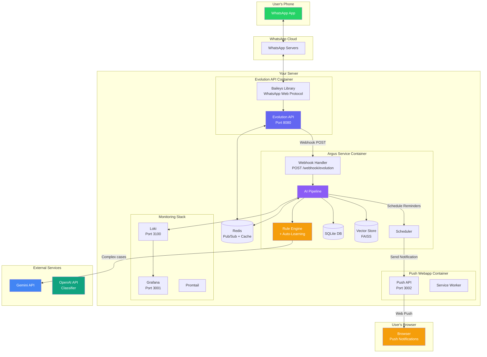
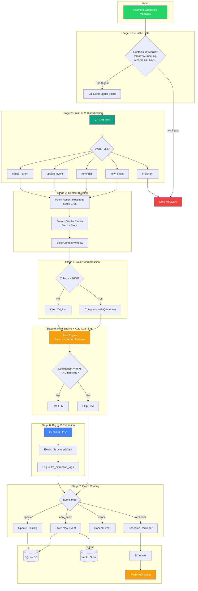
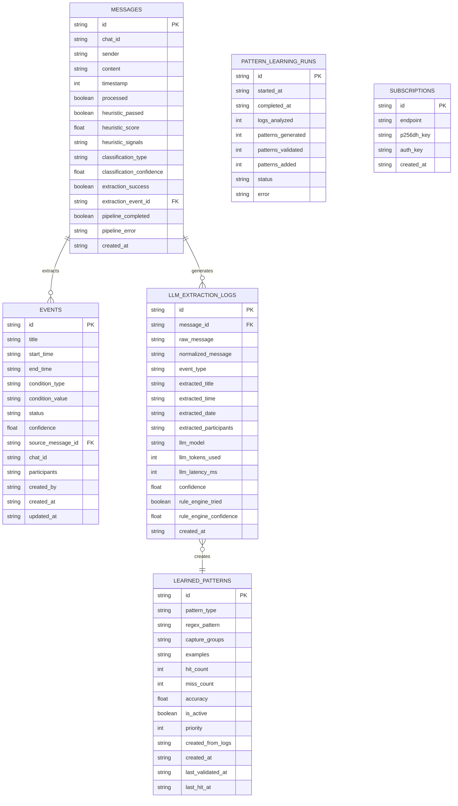
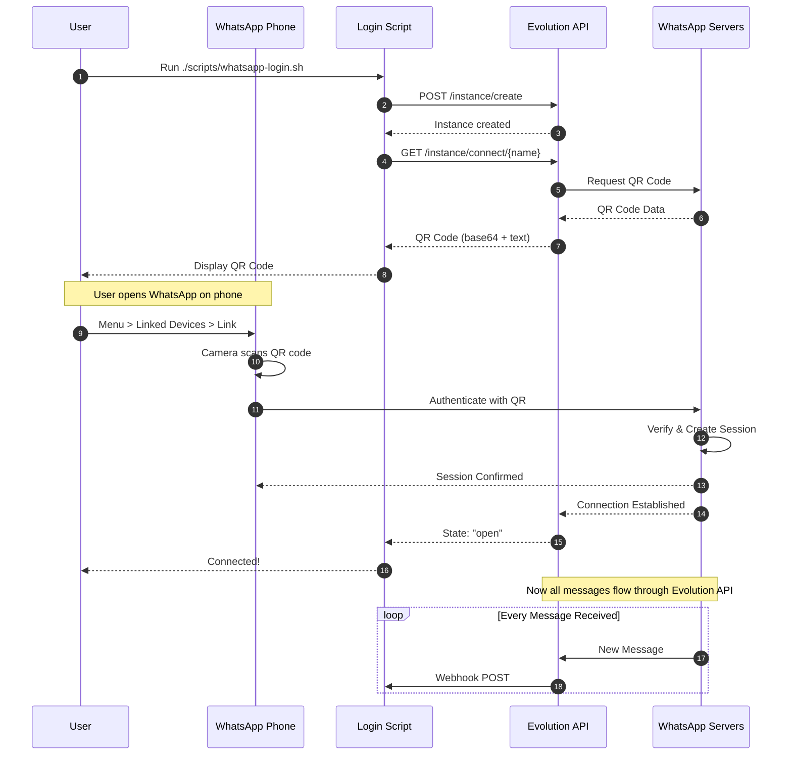
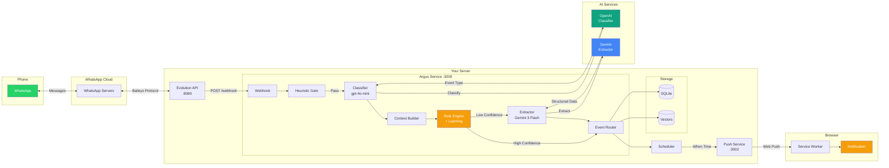
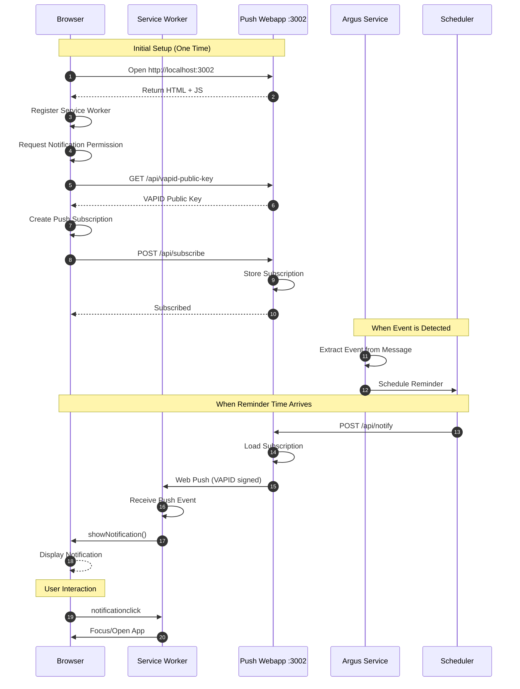
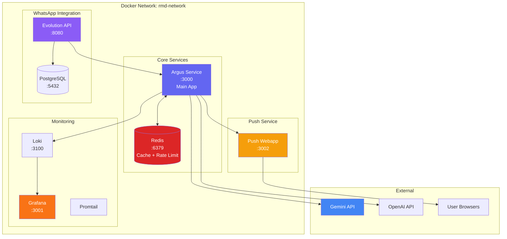
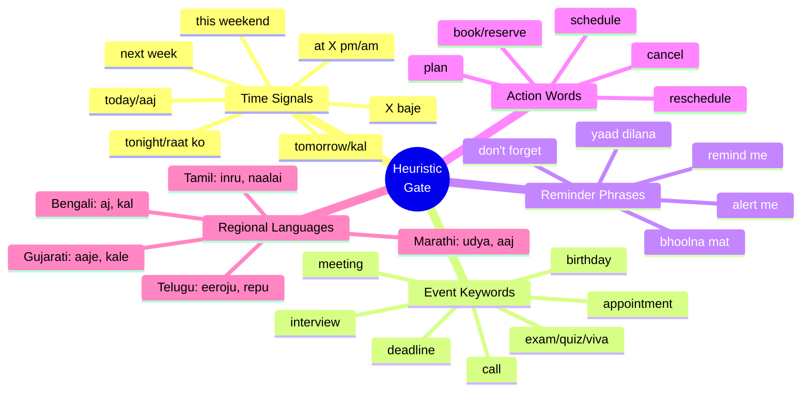
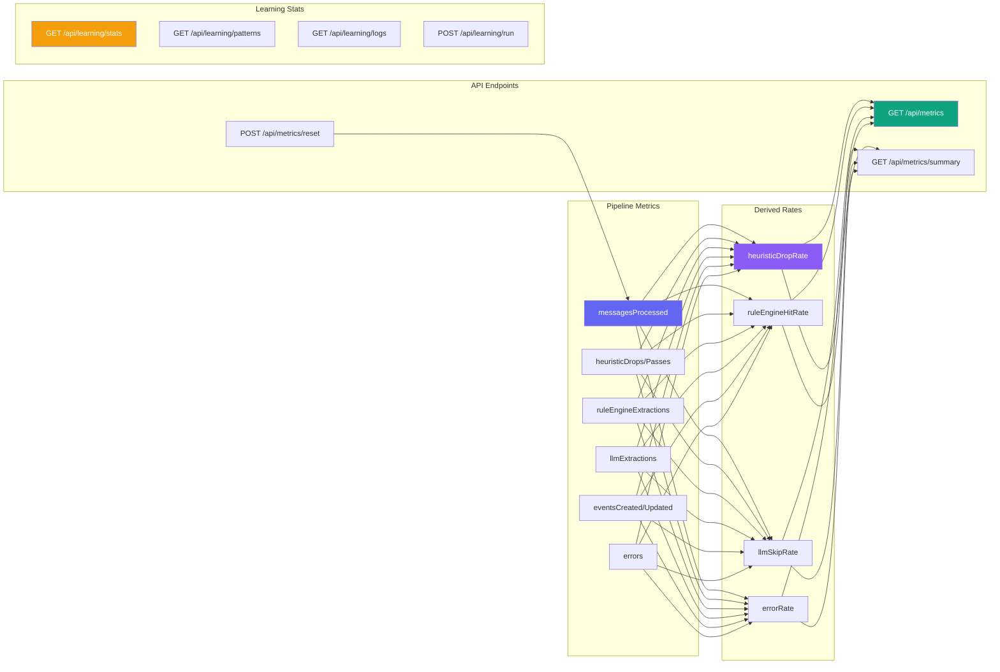

# Argus - Architecture & Flow Diagrams

Open these diagrams in any Mermaid viewer:
- [Mermaid Live Editor](https://mermaid.live)
- VS Code with Mermaid extension
- GitHub (renders automatically in .md files)

---

## 1. System Architecture Overview



---

## 2. Message Processing Pipeline (v0.7.1)



---

## 3. Auto-Learning System (v0.7.1)

```mermaid
flowchart TB
    subgraph "Runtime Processing"
        MSG[Message: "meeting 3 baje"]
        RE[Rule Engine<br/>Static + Dynamic Patterns]
        LLM[LLM Extraction<br/>Gemini 3 Flash]
        LOG[Log to llm_extraction_logs]
    end

    subgraph "Hourly Pattern Learning"
        CRON[Scheduled Task<br/>Every Hour]
        ANALYZE[Analyze Extraction Logs]
        FIND[Find Common Patterns]
        VALID[Validate Against History<br/>70%+ Precision Required]
        STORE[Store in learned_patterns]
    end

    subgraph "Pattern Reload"
        RELOAD[Reload Check<br/>Every 5 Minutes]
        LOAD[Load New Patterns<br/>Into Rule Engine]
    end

    subgraph "Feedback Loop"
        TRACK[Track Hit/Miss<br/>Per Pattern]
        DEACT[Auto-Deactivate<br/>Low Accuracy Patterns<br/>< 50% after 10 attempts]
    end

    MSG --> RE
    RE -->|confidence < 0.75| LLM
    LLM --> LOG
    LOG --> CRON
    CRON --> ANALYZE
    ANALYZE --> FIND
    FIND --> VALID
    VALID --> STORE
    STORE --> RELOAD
    RELOAD --> LOAD
    LOAD --> RE
    RE --> TRACK
    TRACK --> DEACT

    style MSG fill:#25D366,color:#fff
    style RE fill:#f59e0b,color:#fff
    style LLM fill:#4285f4,color:#fff
    style CRON fill:#6366f1,color:#fff
    style STORE fill:#8b5cf6,color:#fff
```

### Pattern Learning Algorithm

1. **Collect Logs**: Gather LLM extractions with confidence >= 0.8
2. **Analyze Patterns**: Look for common patterns:
   - Time patterns: "X baje", "around X pm", "by X am"
   - Date patterns: "agle monday", "coming friday", "end of week"
   - Action patterns: "need to X", "mujhe X karna hai"
3. **Validate**: Require 3+ examples, 70%+ precision
4. **Store**: Add validated patterns to database
5. **Track**: Monitor hit/miss rates
6. **Deactivate**: Remove patterns with <50% accuracy after 10+ attempts

---

## 4. Database Schema (v0.7.1)



---

## 5. WhatsApp Login Flow (QR Code)



---

## 6. Complete Data Flow



---

## 7. Push Notification Flow



---

## 8. Multi-Container Architecture



---

## 9. Heuristic Gate Keywords



---

## 10. Metrics & Monitoring



---

## API Endpoints Reference

### Argus Service (:3000)

| Method | Path | Description |
|--------|------|-------------|
| GET | `/` | Service info & version |
| POST | `/webhook/evolution` | Evolution API webhook |
| POST | `/webhook/test` | Test message endpoint |
| GET | `/webhook/health` | Health check |
| GET | `/api/events` | List extracted events |
| GET | `/api/notifications` | Notification history |
| GET | `/api/metrics` | Pipeline metrics |
| GET | `/api/metrics/summary` | Human-readable metrics |
| POST | `/api/metrics/reset` | Reset metrics |
| GET | `/api/learning/stats` | Pattern learning stats |
| GET | `/api/learning/patterns` | List learned patterns |
| GET | `/api/learning/logs` | LLM extraction logs |
| POST | `/api/learning/run` | Trigger pattern learning |
| DELETE | `/api/learning/patterns/:id` | Deactivate pattern |

### Push Webapp (:3002)

| Method | Path | Description |
|--------|------|-------------|
| GET | `/` | Web interface |
| GET | `/health` | Health check |
| GET | `/api/vapid-public-key` | VAPID public key |
| POST | `/api/subscribe` | Register subscription |
| POST | `/api/notify` | Send notification |

---

## Quick Reference Commands

```bash
# Start all services
./scripts/start.sh

# Stop all services
./scripts/stop.sh

# Login to WhatsApp (requires Evolution API)
./scripts/whatsapp-login.sh

# Send test message
./scripts/test-message.sh "Meeting tomorrow at 3pm"

# Run with Docker
docker compose -f docker/docker-compose.yml up -d

# With Evolution API (full stack)
docker compose -f docker/docker-compose.yml --profile full up -d

# View logs
docker compose -f docker/docker-compose.yml logs -f

# Run tests
npm test -- --run

# Check metrics
curl http://localhost:3000/api/metrics/summary

# Check learning stats
curl http://localhost:3000/api/learning/stats

# Trigger pattern learning
curl -X POST http://localhost:3000/api/learning/run
```

---

## Version History

| Version | Features |
|---------|----------|
| v0.1.0 | Initial pipeline, SQLite, FAISS |
| v0.2.0 | Multi-container, Redis, WebSocket |
| v0.3.0 | Startup scripts, Push webapp |
| v0.4.0 | Rule engine, Regional languages (77 tests) |
| v0.4.1 | Metrics system (51 tests) |
| v0.5.0 | Auto-Learning System (237 tests) |
| v0.6.0 | Pending confirmation, Gemini integration |
| v0.7.0 | Dashboard UI redesign, Gemini 2.5 Flash |
| v0.7.1 | Gemini 3 Flash upgrade, metrics fix |
